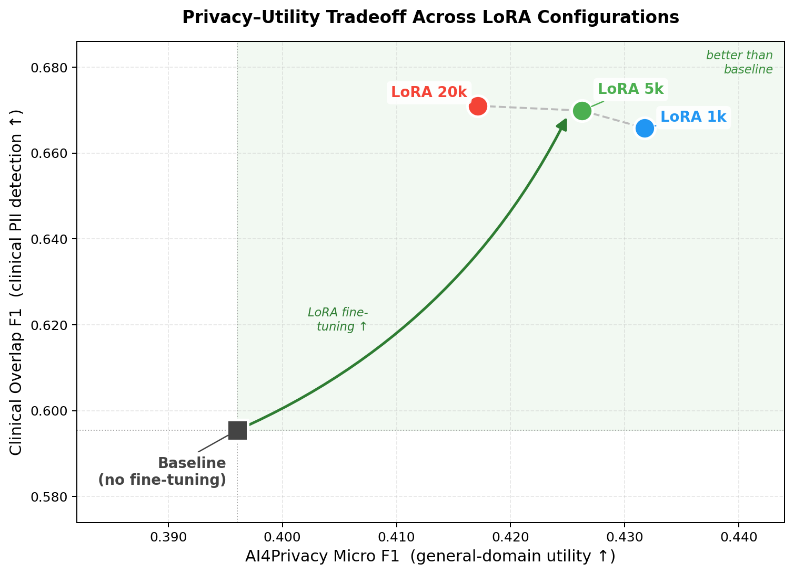
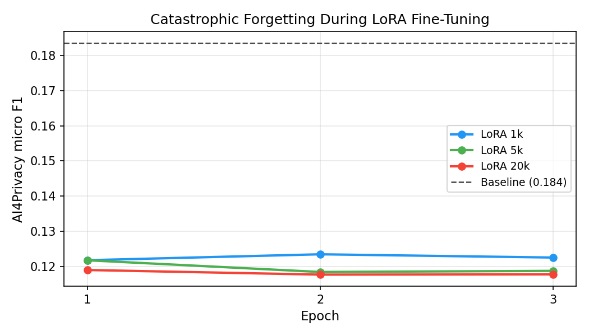
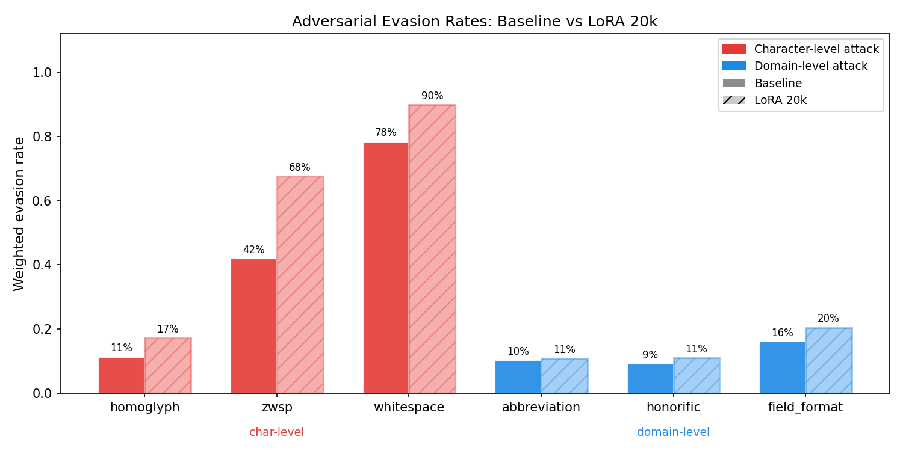

# Medical PII Robustness

Adversarial robustness evaluation of PII detection under clinical domain shift, with LoRA fine-tuning as a defense.

**Course:** EEP 595 – Privacy-Preserving Machine Learning, UW Spring 2026  
**Author:** Jie Yao

---

## Research Question

When a PII redaction model trained on general-domain text is deployed on clinical notes, can adversaries craft inputs that reliably evade detection? Does fine-tuning the model on clinical data close that vulnerability — and for which attack types?

---

## System Overview

**Target model:** [`openai/privacy-filter`](https://huggingface.co/openai/privacy-filter) — a 1.5B parameter sparse MoE token classifier (50M active per inference) with BIOES tagging and a constrained Viterbi decoder. Detects 8 PII categories: `private_person`, `private_address`, `private_email`, `private_phone`, `private_url`, `private_date`, `account_number`, `secret`.

**Attack taxonomy:**

| Category | Attacks | Effect of LoRA fine-tuning |
|---|---|---|
| Character-level | Homoglyph substitution (Latin → Cyrillic/Greek), zero-width space injection, thin-space injection | **Worsens** — model becomes more brittle |
| Domain-level | Clinical abbreviations ("J. Williams"), honorific prepending ("Dr.", "Pt."), field-format embedding ("Attending: \<name\>") | **Neutral** — neither fixed nor worsened |

---

## Results

### Tradeoff: Clinical Detection vs. General-Domain Utility



LoRA fine-tuning on MIMIC discharge notes **improves both axes** over baseline. All three LoRA configurations land in the green "better than baseline" region. Within the LoRA family, the dashed curve shows a subtle tradeoff: more training data pushes clinical F1 up (+0.005) while slowly eroding AI4Privacy F1 (−0.015 from 1k→20k). Clinical performance saturates at 1k samples; LoRA 1k is the practical sweet spot.

### AI4Privacy F1 vs. LoRA Training Size (Forgetting)



Attention-only LoRA (`q_proj`/`v_proj`, rank=8) preserves — and slightly improves — general-domain utility. The corrected evaluation (fixed label map + per-document overlap F1) shows no catastrophic forgetting: all LoRA configs end 2–9% *above* the baseline F1 of 0.396.

### Adversarial Evasion Rates: Baseline vs. LoRA 20k



**Char-level attacks** (red) evade detection far more often after fine-tuning — evasion rate rises +5.9 to +25.6 pp. Fine-tuning causes the model to attend more tightly to clinical surface forms, making it more brittle to Unicode-level perturbations. **Domain-level attacks** (blue) are essentially unchanged (±2%). Fine-tuning neither defends nor worsens against clinical abbreviations and formatting tricks.

### Full Numerical Summary

**General domain (AI4Privacy validation, corrected evaluation):**

| Entity | Precision | Recall | F1 | N |
|---|---|---|---|---|
| `private_person` | 0.440 | 0.842 | 0.578 | 4094 |
| `private_address` | 0.369 | 0.551 | 0.442 | 3212 |
| `private_email` | 0.487 | 0.993 | 0.654 | 942 |
| `private_phone` | 0.351 | 0.964 | 0.515 | 841 |
| `private_date` | 0.193 | 0.958 | 0.321 | 620 |
| `account_number` | 0.080 | 0.914 | 0.146 | 783 |
| `secret` | 0.298 | 0.146 | 0.196 | 2212 |
| **micro avg** | **0.280** | **0.677** | **0.396** | |

**Clinical domain (1,000 MIMIC test notes, overlap F1, corrected per-doc matching):**

| Model | Precision | Recall | F1 |
|---|---|---|---|
| Baseline | 0.467 | 0.820 | 0.595 |
| LoRA 1k | 0.505 | 0.975 | 0.666 |
| LoRA 5k | 0.507 | 0.988 | 0.670 |
| LoRA 20k | 0.508 | 0.990 | **0.671** |

**Adversarial evasion rates (weighted avg across entity types, 2,000 AI4Privacy samples):**

| Attack | Type | Baseline | LoRA 1k | LoRA 5k | LoRA 20k | Δ (20k) |
|---|---|---|---|---|---|---|
| homoglyph | char | 11.3% | 12.1% | 12.5% | 17.2% | **+5.9 pp** |
| zwsp | char | 41.9% | 54.6% | 55.2% | 67.5% | **+25.6 pp** |
| whitespace | char | 78.3% | 86.0% | 86.4% | 89.8% | **+11.5 pp** |
| abbreviation | domain | 10.2% | 9.6% | 7.3% | 10.7% | +0.5 pp |
| honorific | domain | 9.1% | 6.6% | 7.1% | 11.0% | +1.9 pp |
| field_format | domain | 16.0% | 18.7% | 16.8% | 20.5% | +4.5 pp |

---

## Repository Structure

```
medical-pii-robustness/
├── src/
│   ├── baseline_eval.py        # AI4Privacy + MIMIC baseline evaluation
│   ├── adversarial_attacks.py  # 6-attack evasion suite (baseline + LoRA)
│   ├── build_clinical_eval.py  # PII-inject MIMIC notes → labeled JSONL
│   ├── lora_finetune.py        # LoRA fine-tuning with forgetting callback
│   ├── clinical_eval.py        # Span-level F1 on MIMIC test set
│   ├── eval_forgetting.py      # Post-hoc corrected forgetting evaluation
│   ├── plot_results.py         # All result figures + evasion table
│   └── plot_improved.py        # Improved tradeoff + forgetting figures
├── scripts/
│   ├── slurm_baseline_eval.sh
│   ├── slurm_attack_eval.sh
│   ├── slurm_attack_eval_lora.sh
│   ├── slurm_build_clinical_eval.sh
│   ├── slurm_clinical_eval.sh
│   ├── slurm_lora_finetune.sh
│   └── slurm_eval_forgetting.sh
├── results/
│   ├── baseline_eval.json
│   ├── attack_eval*.json
│   ├── clinical_eval_*.json
│   └── figures/
│       ├── privacy_utility_tradeoff.png
│       ├── forgetting_curves.png
│       ├── evasion_comparison.png
│       └── summary.json
└── docs/
    ├── Project_part1.pdf
    ├── Project_part2.pdf
    ├── Project_part3.pdf
    └── Part2_ProgressReport_JieYao.md
```

*`data/`, `*.jsonl`, `results/checkpoints/`, `logs/` are gitignored — MIMIC data never leaves Hyak.*

---

## Setup

**Environment:** Python 3.10 on UW Hyak HPC.

```bash
conda create -n pii-robustness python=3.10
conda activate pii-robustness
pip install transformers datasets torch peft evaluate seqeval scikit-learn pandas matplotlib
```

**Data:**
- AI4Privacy: auto-downloaded via `datasets.load_dataset("ai4privacy/pii-masking-400k")`
- MIMIC-IV-Note 2.2: requires a [PhysioNet Data Use Agreement](https://physionet.org/content/mimic-iv-note/2.2/). Store locally; **never upload raw MIMIC files.**

---

## Reproducing Results

All experiments run on Hyak `ckpt` partition (A40 GPU, 48 GB RAM).

**LoRA fine-tuning hyperparameters:**

| Parameter | Value |
|---|---|
| LoRA rank (r) | 8 |
| LoRA alpha | 16 (= 2r) |
| LoRA dropout | 0.1 |
| Target modules | `q_proj`, `v_proj` |
| Epochs | 3 |
| Batch size | 8 |
| Learning rate | 2e-4 |
| LR scheduler | Cosine |
| Warmup ratio | 0.06 |
| Weight decay | 0.01 |
| Optimizer | AdamW |
| Precision | bf16 |
| Max sequence length | 512 tokens |

3 epochs was sufficient — eval loss converged by epoch 2 across all three training sizes, with negligible improvement in epoch 3.

```bash
# Phase 1 — Baseline evaluation
sbatch scripts/slurm_baseline_eval.sh

# Phase 2.5 — Build PII-injected MIMIC eval set
sbatch scripts/slurm_build_clinical_eval.sh

# Phase 3 — LoRA fine-tuning (3 configs in parallel)
sbatch scripts/slurm_lora_finetune.sh  # submits lora_r8_n{1000,5000,20000}

# Phase 3.5 — Clinical F1 evaluation
bash scripts/slurm_clinical_eval.sh    # submits 4 parallel jobs

# Phase 4 — Attack evasion on baseline
sbatch scripts/slurm_attack_eval.sh

# Phase 4 — Attack evasion on LoRA adapters
bash scripts/slurm_attack_eval_lora.sh # submits 3 parallel jobs

# Post-hoc — Corrected AI4Privacy F1 for all adapters
sbatch scripts/slurm_eval_forgetting.sh

# Figures
python src/plot_improved.py
python src/plot_results.py
```

---

## Key References

- OpenAI. (2025). *OpenAI Privacy Filter Model Card.* `openai/privacy-filter`, HuggingFace.
- Johnson et al. (2023). *MIMIC-IV-Note: Deidentified free-text clinical notes.* PhysioNet v2.2.
- Priva-AI. (2023). *AI4Privacy: Large Language Model PII Masking Dataset.* HuggingFace.
- Hu et al. (2022). *LoRA: Low-Rank Adaptation of Large Language Models.* ICLR.
- Boucher et al. (2022). *Bad Characters: Imperceptible NLP Attacks.* IEEE S&P.
